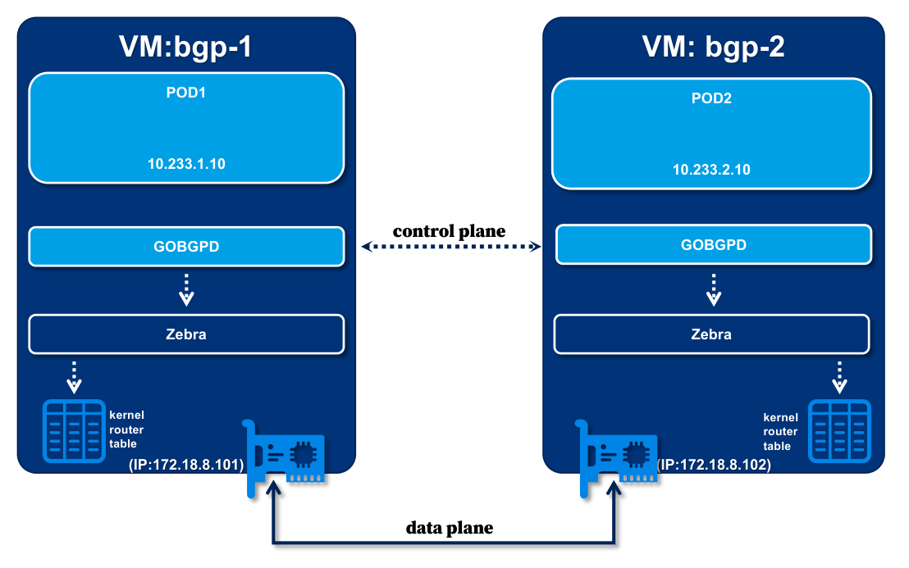

# The prototype of the K8s POD networking

**Using BGP and BIRD to Advertise Pod Routes**


The repository was inspired by [1], but as I'm not familiar with the [multipass](https://multipass.run/) and the BIRD, I chose some alternative software, which is the Vagrant for the *multipass* and [gobgp](https://github.com/osrg/gobgp) for the *BIRD*.

Compared with the original article [1], the repository contains many complete scripts to automatically provision the infrastructure software, including gobgp and quagga. The user just needs to run a few scripts to get the expected result.

## Backgroud

We will leverage the Vagrant to provision two virtual machines (prefer using VirtualBox as the hypervisor). The first vm named `bgp-1`, the second named `bgp-2`. During the provision process, we will set up bellowing services:

1. The zebra service, we setup zebra service via `apt` install`

2. The gobgp service, we download gobpg from the GitHub release page of the gobgp, and set each other node as neighbors. The gobgp can be started and stopped via `systemctl restart gobgp`

3. Prepare the script to create the pod namespace



## Prerequisite

Before you run this demo, you need install following software into system.

- Vagrant (v2.3.0+)
  - Plugin: vagrant-proxyconf (optional)
- VirtualBox (v6.1.36+)


## Step by Step

1. Clone repository

```bash
git clone https://github.com/zhao-kun/k8s-networking-bgp
```

2. Provision VM

```bash
cd k8s-networking-bgp
vagrant up
```

> During the provision, the dependencise will be downloaded, if your network is a restricted network environment, you could specified a proxy via:
> ```bash
>VAGRANT_HTTPS_PROXY="http://XXX.XXX.XXX.XXX:XXXX" VAGRANT_HTTP_PROXY="http://XXX.XXX.XXX.XXX:XXXX" vagrant up
> ```

3. Create POD

```bash
vagrant ssh bgp-1 -- "./CREATE_POD.sh 1"
vagrant ssh bgp-2 -- "./CREATE_POD.sh 2"
```

4. Ping Pod

```bash
vagrant ssh bgp-1 -- ping -c 3 10.233.1.10
vagrant ssh bgp-2 -- ping -c 3 10.233.2.10
```

From each node, the IP address can ping successfully, but we can't ping `POD2` from `bgp-1`.

5. Advertise the route


Advertise rule which routes traffic to pod1 from the `bgp-1`

```bash
vagrant ssh bgp-1 -- gobgp global rib add 10.233.1.10/32
vagrant ssh bgp-1 -- gobgp global rib add 10.233.1.0/24 community blackhole
```

Advertise rule which routes traffic to pod1 from the `bgp-2`
```bash
vagrant ssh bgp-2 -- gobgp global rib add 10.233.2.10/32
vagrant ssh bgp-2 -- gobgp global rib add 10.233.2.0/24 community blackhole

```

6. Checking the rule is applied on the peer node

```bash
vagrant ssh bgp-1 -- ip route
```
A new router rule by the zebra can be gotten:

```
10.233.2.10/24 via 172.18.8.102 dev eth1 proto zebra metric 20
```

```bash
vagrant ssh bgp-2 -- ip route
```
A new router rule by zebra can be gotten:

```
10.233.1.0/24 via 172.18.8.101 dev eth1 proto zebra metric 20
```

7. Ping Pod from the peer node

```bash
vagrant ssh bgp-1 -- ping -c 3 10.233.2.10
vagrant ssh bgp-2 -- ping -c 3 10.233.1.10
```

The pod IP address still can't ping

8. Set proxy_arp option for the `veth` interface

```bash
vagrant ssh bgp-1 -- sudo sysctl --write net.ipv4.conf.veth_vm1.proxy_arp=1
vagrant ssh bgp-2 -- sudo sysctl --write net.ipv4.conf.veth_vm2.proxy_arp=1
```

9. Ping Pod from the peer node again.

```bash
vagrant ssh bgp-1 -- ping -c 3 10.233.2.10
vagrant ssh bgp-2 -- ping -c 3 10.233.1.10
```

Reference:

[1] [Kubernetes Networking from Scratch: Using BGP and BIRD to Advertise Pod Routes](https://dustinspecker.com/posts/kubernetes-networking-from-scratch-bgp-bird-advertise-pod-routes/)
